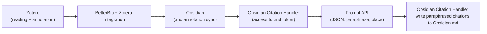
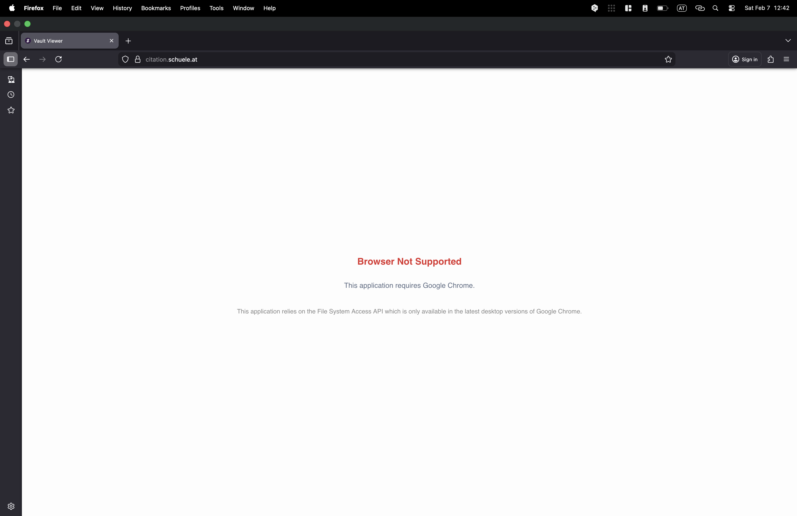
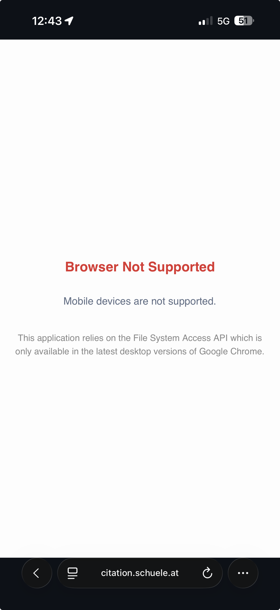

# Obsidian Citation Handler

- [Public Domain](https://citation.schuele.at/)

This project is a quick win for writing scientific papers. It reads obsidian .md files, if they contain exports from Zotero (Annotation tool) they can be used to rephrase (via the Chrome Prompt-API) and provide `Latex` ready snippets including citation.

## Used APIs

- [Chrome Prompt-API](https://developer.chrome.com/docs/ai/prompt-api)
- [Temporal](https://developer.mozilla.org/en-US/docs/Web/JavaScript/Reference/Global_Objects/Temporal)
- [File System API](https://developer.mozilla.org/en-US/docs/Web/API/File_System_API)

## Supported

Due to the requirements of Chrome desktop 144 for the Prompt-API, the page requires this to allow any interaction.


## Usage

### Technical description
1. Zotero is used for scientific reading and annotation.
2. via BetterBib & Zotero Integration the annotations are sync to Obsidian
3. The Obsidian Citation Handler need to get access to the folder where the Obsidian `.md` files are stored.
4. via `Request Citation` button the block of the annotations are passed one by one to the `Prompt API`.
```js
  "Return ONLY valid JSON. No markdown, no code fences, no extra text.",
    "",
    "Schema (exact keys):",
    '{ "paraphrase": string, "place": string }',
    "",
    "Rules:",
    "1) paraphrase: one sentence, no direct quoting, no newline.",
    "2) place: 2–6 words, lowercase, use spaces or hyphens only.",
    "3) Ensure the JSON is strictly valid (escape any quotes).",
    "",
    `highlight: ${quote}`,
```
5. Additionally to the requested format it's again validated in `JavaScript`.
6. A `html` table is formed, incl. a button to copy the paraphrased citation incl. `\autocite[PAGE]{CITATION-KEY}` latex annotation.

### User Flow Diagram


### User Flow

<video controls width="800">
  <source src="static/zotero-obsidian-citation-handler.mp4" type="video/mp4">
</video>

### Unsupported Handling
#### Unsupported Screenshot Firefox


#### Unsupported Screenshot iPhone Safari

